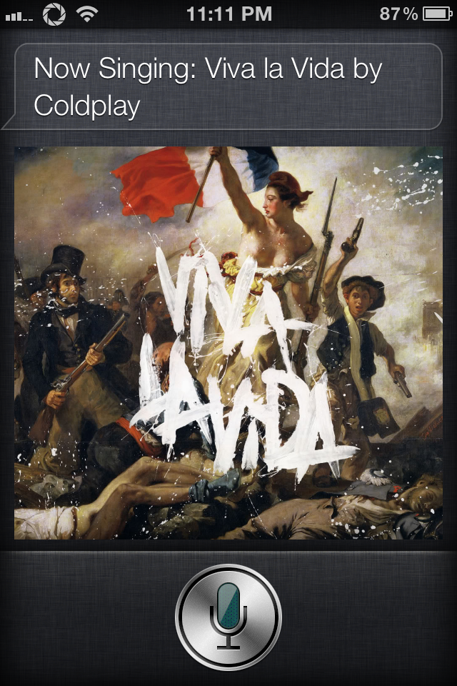
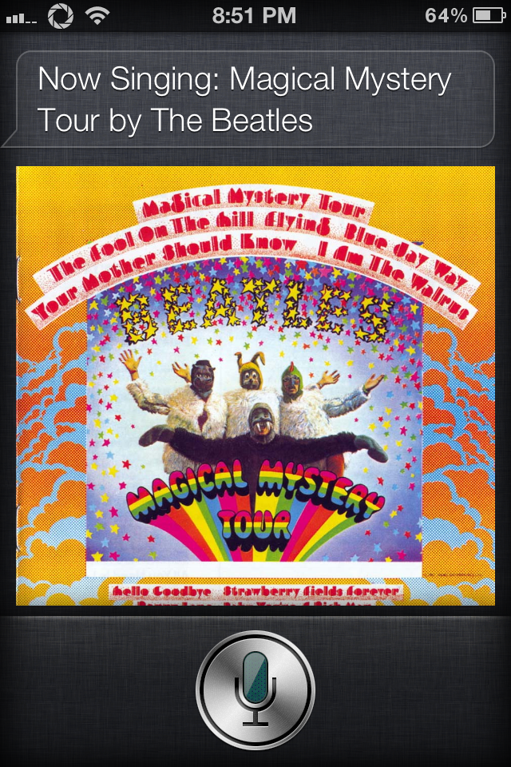
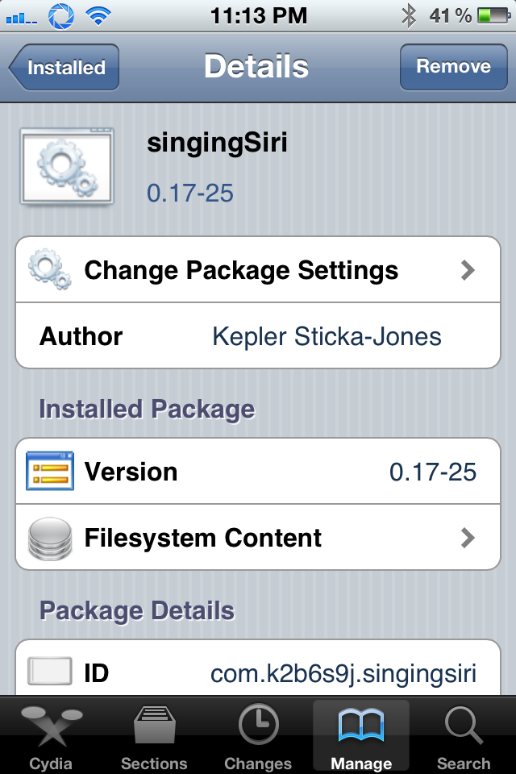

singingSiri was built using [iOSOpenDev](http://iosopendev.com) for the [AssistantExtensions](https://github.com/k3a/AssistantExtensions) framework. It features a the lyrics of a few songs:

- [_American Idiot_ by Green Day](https://genius.com/Green-day-american-idiot-lyrics)
- [_Bohemian Rhapsody_ by Queen](https://genius.com/Queen-bohemian-rhapsody-lyrics)
- [_Buddy Holly_ by Weezer](https://genius.com/Weezer-buddy-holly-lyrics)
- [_Firework_ by Katy Perry](https://genius.com/Katy-perry-firework-lyrics)
- [_Friday_ by Rebecca Black](https://genius.com/Rebecca-black-friday-lyrics)
- [_Grenade_ by Bruno Mars](https://genius.com/Bruno-mars-grenade-lyrics)
- [_Harder, Better, Faster, Stronger_ by Daft Punk](https://genius.com/Daft-punk-harder-better-faster-stronger-lyrics)
- [_Imagine_ by John Lennon](https://genius.com/John-lennon-imagine-lyrics)
- [_Magical Mystery Tour_ by The Beatles](https://genius.com/The-beatles-magical-mystery-tour-lyrics)
- [_Moves Like Jagger_ by Maroon 5](https://genius.com/Maroon-5-moves-like-jagger-lyrics)
- [_Party Rock Anthem_ by LMFAO](https://genius.com/Lmfao-party-rock-anthem-lyrics)
- [_Still Alive_ by Jonathan Coulton (from Valve's Portal)](https://genius.com/Jonathan-coulton-portal-still-alive-lyrics)
- [_Want You Gone_ by Jonathan Coulton (from Valve's Portal 2)](https://genius.com/Aperture-science-psychoacoustic-laboratories-want-you-gone-lyrics)
- [_Pumped Up Kicks_ by Foster The People](https://genius.com/Foster-the-people-pumped-up-kicks-lyrics)
- [_Rolling In The Deep_ by Adele](https://genius.com/Adele-rolling-in-the-deep-lyrics)
- [_Sexy And I Know It_ by LMFAO](https://genius.com/Lmfao-sexy-and-i-know-it-lyrics)
- [_Super Bass_ by Nicki Minaj](https://genius.com/Nicki-minaj-super-bass-lyrics)
- [_Technologic_ by Daft Punk](https://genius.com/Daft-punk-technologic-lyrics)
- [_The Times They Are A-Changin'_ by Bob Dylan](https://genius.com/Bob-dylan-the-times-they-are-a-changin-lyrics)
- [_Я очень рад, ведь я, наконец, возвращаюсь домой (I am Glad, 'cause I'm Finally Returning Back Home/The Trololo Song)_ by Eduard Khil (The Trololo Guy)](https://knowyourmeme.com/memes/trololo-guy)
- [_Viva la Vida_ by Coldplay](https://genius.com/Coldplay-viva-la-vida-lyrics)
- [_What's My Name?_ by Rihanna](https://genius.com/Rihanna-whats-my-name-lyrics)

Screenshots of singingSiri in Action:

