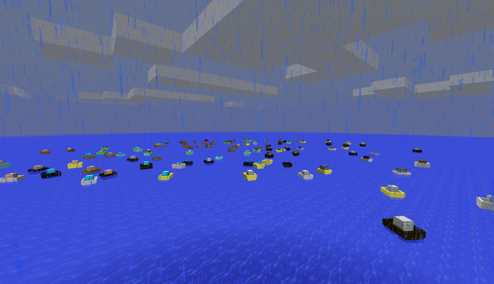

Below is an archive of the post announcing the release of version 2.0.1 of my Minecraft 1.7.2 mod BoatCraft on the Minecraft Forums on May 9, 2014.

The content below was edited with correct URLs on July 28, 2019. The original post can be found on [Minecraft Forums](https://www.minecraftforum.net/forums/mapping-and-modding-java-edition/minecraft-mods/1290984-1-7-2-forge-boatcraft-2-0-1-the-end-of-the-great).

---

# BoatCraft

**By: [Kepler Sticka-Jones](https://keplersj.com/)**

**Maintained By: [Open Code Developers](https://github.com/Open-Code-Developers)**

Rails had their turn, now out to the Minecraftian seas. Out there we will interact with our boats in ways that we had only dreamed of and ways that we had never thought of before. This mod will overhaul your oceans and how you will experience them. Will you turn your shoreline into an industrial outlet, or will you take advantage of your nearby Seaport and get all the booty you could ever wish for? So go ahead take your world out to sea and never worry about a creeper destroying your rails and pipes again, but watch out because one day you might turn around and see them, the pirate mobs!

## Downloads

All approved 'stable' builds of BoatCraft can be found on our [GitHub Releases Page](https://github.com/keplersj/BoatCraft/releases), however support on only the latest version will be offered by Open Code Developers.

Feeling a bit risky? Want bleeding edge stuff? Aren't you lucky then that we offer bleeding edge builds on our [continuous integration](https://drone.io/github.com/Open-Code-Developers/BoatCraft/files). Unless stated by an Open Code Developers member we will not be offering support for any of these builds.

## Support

Support is offered by members of Open Code Developers in the following channels:

- [The BoatCraft Thread on Minecraft Forums](https://www.minecraftforum.net/forums/mapping-and-modding-java-edition/minecraft-mods/1290984-1-7-2-forge-boatcraft-2-0-1-the-end-of-the-great)
- [The BoatCraft Gitter Chat Room](https://gitter.im/Open-Code-Developers/BoatCraft)
- [The BoatCraft Issue Tracker on GitHub](https://github.com/keplersj/BoatCraft/issues)

## Ideas and Suggestions

Have an idea you want to share with us? We'd love to hear it! Create an issue on our [issue tracker](https://github.com/keplersj/BoatCraft/issues) and tell us all about it! We will discuss whether or not it will make it's way into BoatCraft and update you on it's progress if we do it!

## License

As per the MIT License that BoatCraft is licensed under you are permitted you use BoatCraft for commercial use, distribute it freely, modify it, and use it privately. You are required to show the BoatCraft License and Copyright when you interact with BoatCraft. And above all you may not hold anyone covered by the BoatCraft License and Copyright liable for damages inflicted while using BoatCraft.

For information on the MIT License, and what it means for you, please visit [this page](http://choosealicense.com/licenses/mit/).

For more information on Open Source Software, and what it means for, please visit [this page](http://opensource.org/osd).

## Modpacks

Modpacks are considered are re-distribution of BoatCraft, therefore you must follow the terms of redistribution stated above.

## Servers

Yes. You can use BoatCraft on your server. And yes, we will support you if you use MCPC+. Just please follow the license like everybody else.

## Let's Plays, Spotlights, and other Creations

Yes you may use BoatCraft in your videos and other creations. Again just follow the permissive MIT License.

## Translations

BoatCraft will now localize like any other mod! To add a translation just make a pull request with with your translations [here](https://github.com/Open-Code-Developers/BoatCraft/tree/master/src/main/resources/assets/boatcraft/lang).

## Source Code

And yes, of course like any open source piece of software our [source code](https://github.com/keplersj/BoatCraft) is available online for free!
